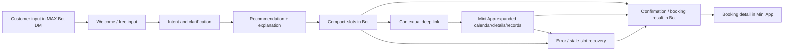
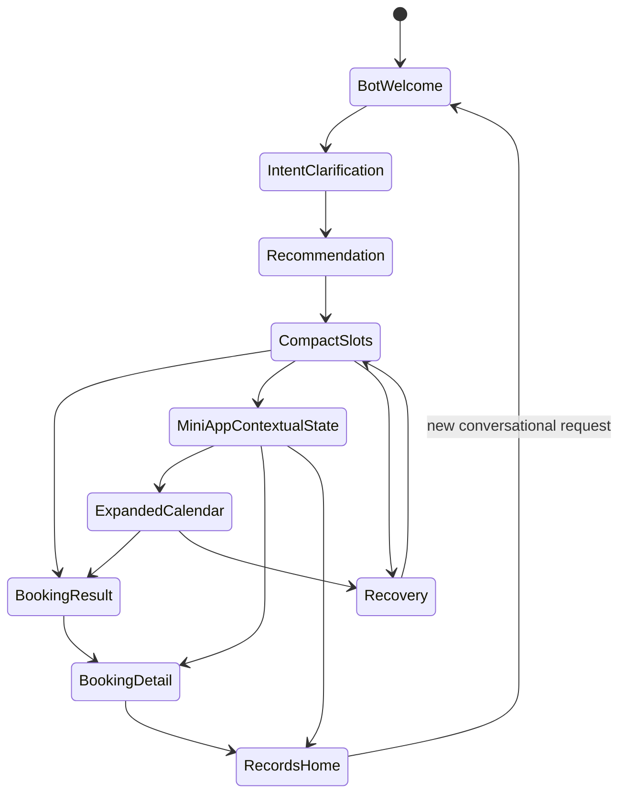

# Ayla Client Mini App / Mobile App UX — Deep KB Audit

Дата аудита: 2026-08-25  
Объект: `ayla-knowledge`, branch `main`  
Режим: read-only forensic-аудит KB. Код, KB, PR и продуктовая логика не изменялись.

## 0. Executive verdict

Последняя принятая в KB клиентская модель MVP — не полноценное standalone mobile app с доказанным bottom tab bar. В текущем customer pilot каноническая surface-модель состоит из:

`MAX Bot DM` для диалога, понимания намерения, recommendation, compact slots, confirmation, ошибок и уведомлений; `MAX Mini App` для expanded calendar, booking details, records и управления записью.

Для Mini App home Phase 1 owner decision прямо фиксирует `SCR-CUST-010 — Records list (upcoming/history)`. При известном контексте используется contextual deep link; generic home открывать не следует.

Явная трёхпунктовая навигация `Today | Schedule | Ayla` действительно есть в KB, но она относится к Master App, не к Client. Более того, документы Master имеют `status: draft`, `canonical_status: candidate`; это не доказательство клиентской навигации.

| Область | Verdict | Доказательство |
|---|---|---|
| Client MVP surface model | SUPPORTED | `01 Product/UX MVP/02-screen-inventory-customer.md:90-151`; `ux-owner-decisions.md:227-249` |
| Client Mini App home | SUPPORTED | `ux-owner-decisions.md:227-249`; `UX-GAP-P1-registry.md:35-62` |
| Client bottom navigation | NOT FOUND / INSUFFICIENT EVIDENCE | canonical customer inventory не задаёт tab bar; старая SRC-12 помечена stale |
| `Today | Schedule | Ayla` | MASTER-ONLY | `07 UX/Ayla Master System and Recovery UX Contract.md:283-291`; `07 UX/Ayla Master App Information Architecture.md:153` |
| Standalone client mobile app | POST-PILOT / NOT SPECIFIED | `01 Product/UX MVP/context/current-session-brief.md:64-67` |
| Wellness / food / water / progress surfaces in pilot | DEFERRED | `02-screen-inventory-customer.md:158-176` |
| MAX Bot ↔ Mini App handoff | SUPPORTED WITH OPEN DETAILS | `ux-owner-decisions.md:191-225`; `SCR-CUST-006.md`; `SCR-CUST-008.md` |
| Canonicality of UX source set | PARTIAL | customer inventory is `draft`; several P0 gaps remain open |

### Direct answer to the suspected three-tab model

В актуальной KB нет доказательства, что у Client был принят bottom navigation из трёх пунктов с последним `Ayla`. Найденное точное решение `Сегодня | Расписание | Ayla` — Master MVP navigation. Старые клиентские документы, которые могли содержать другой вариант навигации, не импортированы в KB полностью: они представлены как внешний stale source `SRC-12` и доступны только косвенно.

Это означает:

- утверждать, что Client имел tabs `Главная | ... | Ayla`, нельзя — `INFERRED/NEEDS SOURCE`;
- называть такую навигацию текущим canonical решением нельзя;
- смешение с Master — подтверждённый риск чтения KB, но не доказанный дефект runtime.

## 1. Audit method and canon hierarchy

Приоритет применён в таком порядке:

1. CANON_INDEX и его статусная модель;
2. explicit owner decision / Decision Log;
3. актуальные customer screen inventory и screen contracts;
4. current session brief и gap registry;
5. старые handoff/design artifacts;
6. внешние historical references, только как evidence of history.

`00 Foundation/Canon Governance/CANON_INDEX.md:30-41` определяет статусы `CANONICAL`, `CANONICAL_DRAFT`, `READY_FOR_OWNER_REVIEW`, `DRAFT`, `LEGACY`, `DUPLICATE`, `MISSING`, `SUPERSEDED`. Сам CANON_INDEX имеет `status: draft`, `version: 0.2`, `updated: 2026-08-20`, поэтому он является реестром иерархии, а не заменой owner decisions.

`00 Foundation/Canon Governance/OWNER_DECISION_REGISTER.md:30-35` требует считать approved owner decisions обязательными в пределах области действия; старые решения не импортируются автоматически.

## 2. Canon / source inventory

| Path | Version / date | Status | Role in audit |
|---|---|---|---|
| `00 Foundation/Canon Governance/CANON_INDEX.md` | v0.2 / 2026-08-20 | draft registry | иерархия статусов и source registry |
| `00 Foundation/Canon Governance/OWNER_DECISION_REGISTER.md` | v0.3 / 2026-08-22 | draft register | правило приоритета owner decisions |
| `01 Product/UX MVP/decisions/ux-owner-decisions.md` | v0.4 / 2026-08-02 | approved | UX-OD-001…005; surface split и home |
| `01 Product/UX MVP/02-screen-inventory-customer.md` | v0.6 / 2026-08-02 | draft | основной customer screen inventory |
| `01 Product/UX MVP/waves/design-wave-1a.md` | v0.2 / 2026-08-02 | draft | Wave 1 customer surfaces и readiness |
| `01 Product/UX MVP/gaps/UX-GAP-P1-registry.md` | v0.1 / 2026-07-29 | draft | закрытие вопросов home и surface assignment |
| `01 Product/UX MVP/context/current-session-brief.md` | v0.5 / 2026-08-02 | draft | текущий scope, gaps, out-of-scope repos |
| `01 Product/UX MVP/00-ux-source-index.md` | v0.2 | draft | provenance и stale-source registry |
| `01 Product/UX MVP/handoffs/customer-inventory-handoff.md` | v0.1 / 2026-07-29 | delivered handoff | исторический handoff, решения уже закрыты owner decisions |
| `01 Product/UX MVP/screens/customer/SCR-CUST-001.md` | v0.1 / 2026-07-29 | draft | welcome / entry |
| `01 Product/UX MVP/screens/customer/SCR-CUST-003.md` | v0.1 / 2026-07-29 | draft | intent / clarification |
| `01 Product/UX MVP/screens/customer/SCR-CUST-004.md` | v0.1 / 2026-07-29 | draft | recommendation |
| `01 Product/UX MVP/screens/customer/SCR-CUST-006.md` | v0.1 / 2026-07-29 | draft | slots / Mini App deep link |
| `01 Product/UX MVP/screens/customer/SCR-CUST-007.md` | v0.1 / 2026-07-29 | draft | booking result |
| `01 Product/UX MVP/screens/customer/SCR-CUST-008.md` | v0.1 / 2026-07-29 | draft | confirmation / record detail |
| `07 UX/Ayla Master System and Recovery UX Contract.md` | v0.1 / 2026-08-16 | draft, candidate | Master-only navigation evidence |
| `07 UX/Ayla Master App Information Architecture.md` | v0.1 / 2026-08-17 | draft, candidate | Master-only IA evidence |

### Source limitation

`01 Product/UX MVP/00-ux-source-index.md:47` регистрирует `SRC-12` как “Customer screen specs (10 files, 2026-05)” из `ai-bot-platform/docs/screens/customer-*.md`, но с пометкой `draft, stale`, material for inventory, **NOT canon**. `01 Product/Research/Ayla MVP C01 C02 UX Inventory.md:125` подтверждает, что полный первичный текст SRC-12 в KB отсутствует.

Следовательно, старые BeautyGo/Ayla Client screens и их navigation нельзя восстановить по одной ссылке на SRC-12. Для точного исторического diff нужен сам архив/source repository; в рамках текущей KB это `NEEDS SOURCE`, а не canonical evidence.

## 3. Scope separation

### Client / customer

Approved pilot channel: `MAX Bot + MAX Mini App`, Penza, pilot 2026-08-15 — `02 Strategy/Ayla Decision Log.md:109-121`; повторено в `current-session-brief.md`.

### Master

Master App имеет собственную IA и собственный navigation contract. Его `Today | Schedule | Ayla` нельзя переносить на Client. `Ayla Master App Information Architecture.md` прямо описывает operational home, schedule и Master appointment/customer context.

### Standalone mobile app

`current-session-brief.md:64-67` помещает `frontAyla` mobile apps в этап 2 и исключает их из текущего customer screen inventory. В актуальном MVP KB нет принятой полной IA standalone Client App.

### MAX Bot

Bot DM — не tab Mini App. Это conversational surface с welcome, free input, clarification, recommendation, compact slots, confirmation, fallback и notifications — `02-screen-inventory-customer.md:90-151`.

## 4. Evolution of client navigation and entry model

| Период / источник | Модель | Статус | Вывод |
|---|---|---|---|
| Historical SRC-12, 2026-05 | Старые customer screen specs, полный текст отсутствует | stale, non-canonical | Возможные старые home/tabs не могут быть проверены по текущей KB |
| Handoff, 2026-07-29 | 17 customer screens на Bot DM + Mini App; landing ещё требовал решения | handoff artifact | Историческая точка до UX-OD-004/005 |
| UX-OD-004, 2026-07-29 | Bot owns compact transactional steps; Mini App owns expanded actions | accepted | Закрывает surface assignment |
| UX-OD-005, 2026-07-29 | Mini App Phase 1 home = `SCR-CUST-010 Records list` | accepted | Закрывает home ambiguity |
| Inventory v0.6, 2026-08-02 | 19 customer screens, W1/W2, Bot + Mini App | draft inventory aligned to decisions | Текущая детальная customer model |
| Master contracts, 2026-08-16/17 | `Today | Schedule | Ayla` | draft/candidate, Master-only | Не Client navigation |

Не найдено в актуальной KB отдельного owner decision, который задаёт Client bottom nav из трёх tabs. Не найдено и canonical решения `Главная | День | Ayla`, `Главная | Записи | Ayla` или аналогичного Client варианта.

## 5. Actual customer surface model

### Bot DM

| Surface | Screen | Pilot status | Фактическая роль по KB |
|---|---|---|---|
| Welcome / Entry | SCR-CUST-001 | W1, ready with assumptions | greeting, positioning, free input, contextual quick actions |
| Intent / clarification | SCR-CUST-003 | W1, ready with assumptions | semantic intent, clarification |
| Recommendation | SCR-CUST-004 | W1, partial | primary + up to 2 alternatives, explanation, CTA |
| Empty / no recommendation | SCR-CUST-005 | W1 | no-result and recovery |
| Compact slots | SCR-CUST-006 | W1 | short slot selection, deep link to Mini App when needed |
| Booking result | SCR-CUST-007 | W1 | pending, success only after backend confirmation, failure/retry |
| Confirmation / reminder | SCR-CUST-008 / 014 | W1 | confirmation, reminder and open-record entry |
| Cancel / reschedule | SCR-CUST-012 / 013 | W1 assumptions | minimal conversational action, expanded selection in Mini App |
| Safety | SCR-CUST-016 | W1 | safety boundary |
| Terminal fallback | SCR-CUST-019 | W1 | honest self-service fallback |

### Mini App

| Surface | Screen | Pilot status | Фактическая роль по KB |
|---|---|---|---|
| Registration / MAX OAuth | SCR-CUST-009 | W1 partial | identity gate required for booking |
| Records / home | SCR-CUST-010 | W1 ready | upcoming/relevant booking states/history when available |
| Booking detail | SCR-CUST-011 | W1 ready with assumptions | details and actions; can link back to Bot |
| Expanded calendar / slots | SCR-CUST-006 | W1 ready | long slot lists, calendar/day grouping, filters |
| Profile hub | SCR-CUST-018 | W2 partial | “Я”, header, notifications, privacy; not Phase 1 home |
| Memory & privacy | SCR-CUST-017 | W2 blocked | “Что Ayla знает”, revoke/forget/delete fact; persistent memory disabled in Phase 1 |

`02-screen-inventory-customer.md:158-176` explicitly defers wellness dashboard, food scanner, water tracker, proactive recommendations, onboarding S3-S5, profile delete/export and Telegram variants.

## 6. Home, Day, Records, Profile and wellness surfaces

### Home

Client Mini App Phase 1 home is records list, not a wellness dashboard. This is an accepted owner decision, not an inference: `ux-owner-decisions.md:227-249`; closure is repeated in `UX-GAP-P1-registry.md:35-62`.

### Day / Today

`Today` is explicitly evidenced as a global navigation destination for Master, not Client: `Ayla Master System and Recovery UX Contract.md:283-291`. In customer inventory there is no adopted Client `Today` tab. Calendar/day grouping exists inside the expanded slot picker, `SCR-CUST-006`, and is not evidence of a client bottom-nav tab.

### Records / appointments

`SCR-CUST-010` is the Phase 1 Mini App home and contains upcoming/relevant states/history when available. `SCR-CUST-011` is booking detail. Cancellation/reschedule entry points are scoped around these surfaces, with Bot DM owning minimal conversational actions.

### Profile

`SCR-CUST-018` is a W2 partial Mini App profile hub (“Я”: header, notifications, privacy). It is not the current Phase 1 home and does not establish a three-tab navigation.

### Wellness, food, body, sleep, water, progress

The current customer pilot inventory excludes these as product centers. The wellness dashboard and food scanner are deferred. Product Essence v1.2 describes food/water/sleep/fitness as tools around Ayla rather than separate centers, but that document is a draft/candidate and cannot override the accepted customer MVP inventory.

### Ayla / AI entry point

In the current customer pilot, Ayla is the Bot DM conversational surface and recommendation flow. No canonical Client Mini App “Ayla tab” was found. The exact `Ayla` bottom-nav destination belongs to Master candidate documents.

## 7. MAX Bot ↔ Mini App transitions

Evidence:

- UX-OD-004: Bot DM owns compact slots, intent confirmation, pending, result, retry/stale-slot recovery; Mini App owns expanded calendar, booking details, records, management and complex filters — `ux-owner-decisions.md:191-225`.
- Contextual link must preserve service/specialist/dates/recommendation_id/conversation context ref and must not fall back to generic home when context is known — same source.
- `SCR-CUST-006` defines calendar/day slot display and stale-slot handling.
- `SCR-CUST-008` defines confirmation and “Open record” transition.

Open detail: the Mini App → Bot deep-link shape is described as a proposal/assumption in screen contracts, so the product model is supported while the exact technical handoff contract remains partial.

## 8. Screen lifecycle and readiness

Readiness in the inventory is not runtime implementation evidence. The inventory itself is `status: draft`; many screens are `READY_WITH_ASSUMPTIONS` or `PARTIAL`, while W2 screens are blocked/deferred. Therefore:

- `READY` means the screen contract is considered ready in the UX workstream;
- it does not prove route, frontend, MAX init data, API or production reachability;
- `BLOCKED` and `DEFERRED` must not be described as implemented capabilities.

## 9. Current navigation verdict

### Supported

- Customer pilot uses MAX Bot DM + MAX Mini App.
- Phase 1 Mini App home is records list `SCR-CUST-010`.
- Contextual deep links may bypass home.
- Expanded calendar/details/records belong to Mini App; short transactional interaction belongs to Bot.
- Profile, memory/privacy and wellness surfaces are not Phase 1 home/navigation commitments.

### Not supported by current KB

- Client bottom navigation with exactly three items.
- Client bottom navigation whose last item is Ayla.
- Client `Today` tab as a global destination.
- Full standalone mobile Client App IA.
- Client tabs for food, water, body, sleep or progress in the pilot.

### Historical uncertainty

The missing full text of SRC-12 prevents a reliable reconstruction of old BeautyGo/Ayla Client tabs. Any claim about a previous `Главная / Питание / Я`, `Главная / День / Профиль`, or similar variant is `NEEDS SOURCE` until the referenced 10 files or their git history are supplied.

## 10. KB divergence / gap matrix

| Capability / question | KB evidence | Actual KB conclusion | Verdict | Severity |
|---|---|---|---|---|
| Canonical Client home | UX-OD-005; inventory; P1 registry | Records list SCR-CUST-010 | SUPPORTED | P0 for pilot truth if contradicted by UI |
| Client bottom nav | No owner decision or customer contract | Not specified | NOT IMPLEMENTED AS KB DECISION | P1 |
| Three tabs ending in Ayla | Master contracts only | Master-only candidate | MISMATCH if attributed to Client | P1 |
| Master `Today\|Schedule\|Ayla` | Master contract §13; IA §4 | Explicit Master navigation | SUPPORTED FOR MASTER / NOT CLIENT | P2 |
| Bot/Mini App ownership | UX-OD-004 | Explicit split | SUPPORTED | P0 |
| Contextual deep link | UX-OD-004, SCR-CUST-006 | Required, exact technical contract partly open | PARTIAL | P1 |
| Booking detail / records | SCR-CUST-010/011 | W1 customer surfaces | SUPPORTED IN UX MODEL | P1 |
| Profile hub | SCR-CUST-018 | W2 partial | PARTIAL / DEFERRED | P2 |
| Memory/privacy UI | SCR-CUST-017 | W2 blocked | BLOCKED | P1 |
| Wellness dashboard | inventory deferred section; P1-01 closure | Excluded from Phase 1 | NOT IMPLEMENTED IN PILOT MODEL | P1 |
| Food scanner / water tracker | inventory deferred section | Excluded from Phase 1 | NOT IMPLEMENTED IN PILOT MODEL | P1 |
| Standalone mobile app | current-session-brief files_not_needed | Stage 2 | UNREACHABLE / OUT OF SCOPE | P2 |
| Historical BeautyGo navigation | SRC-12 reference only | Source absent | INSUFFICIENT EVIDENCE | P2 |

## 11. P0 / P1 / P2 findings

### P0

No new product P0 was established by this KB-only audit. The potential P0 is operational: if an implementation exposes a Client three-tab bar or wellness home contrary to UX-OD-005, it would contradict the pilot journey. That runtime fact was not inspected here and remains `NEEDS RUNTIME READBACK`.

### P1

1. **Client navigation is under-specified as a global chrome contract.**  
   Impact: design and implementation teams can mistakenly import Master `Today | Schedule | Ayla` into Client or invent tabs.  
   Evidence: customer inventory and owner decisions define surfaces/deep links but no Client tab bar; Master navigation is separately explicit.  
   Minimum direction: owner decision is needed only if a global Client nav is required; no change was made.

2. **Historical customer source is incomplete.**  
   Impact: impossible to prove all legacy BeautyGo/Ayla Client variants or establish exact supersession.  
   Evidence: SRC-12 is stale external material and only indirect references remain.  
   Minimum direction: recover source artifact/history for audit; no KB edit was made.

3. **Exact Mini App ↔ Bot technical handoff remains partially specified.**  
   Impact: a screen may exist in UX inventory while contextual return routing is not deterministically reachable.  
   Evidence: UX-OD-004 requires context preservation; screen contracts describe some reverse links as proposal/assumption.

### P2

1. Standalone `frontAyla` mobile app IA is explicitly deferred to Stage 2.
2. Profile, memory/privacy, wellness, food and water surfaces have partial/deferred status and must not be represented as current Phase 1 navigation.
3. Several source indexes and inventories remain drafts; status drift is possible until owner review closes them.

## 12. Expected vs actual state model

### Expected current Client MVP model from KB

### Explicitly not part of this Phase 1 state model

`Today` Client tab, Ayla Client tab, wellness dashboard home, food scanner, water tracker, proactive recommendation center and standalone mobile-app navigation.

## 13. Open owner decisions

Only genuinely unresolved questions:

1. Is a global Client Mini App bottom navigation required at all in Phase 1?
2. If yes, what are its exact destinations, and how does it coexist with contextual deep links to records/calendar/detail?
3. Is the intended Client “Ayla entry” the Bot DM only, a Mini App route, or a future tab? Current KB does not make this an approved Client navigation decision.
4. Which historical SRC-12/BeautyGo artifact is authoritative enough to reconstruct legacy navigation and its supersession chain?
5. What is the final technical contract for Mini App → Bot return links and MAX identity/context handoff?

These are owner questions, not recommendations to redesign the product.

## 14. Final answers

1. **Последняя принятая клиентская модель:** MAX Bot DM + MAX Mini App; Phase 1 home Mini App — список записей `SCR-CUST-010`.
2. **Все найденные явные варианты bottom navigation:** текущий явный вариант `Today | Schedule | Ayla` найден только в Master App candidate documents. Для Client canonical вариант bottom tabs не найден.
3. **Статус старых BeautyGo/Ayla Client screens:** SRC-12 существует только как stale external source reference; полный текст отсутствует в KB, поэтому исторические tabs не VERIFIED.
4. **Главное смешение:** Master `Today | Schedule | Ayla` нельзя считать Client navigation.
5. **Фактически принятый Client navigation principle:** surface assignment и contextual deep-link routing, а не доказанный persistent bottom tab bar.

### Overall classification

**E. INSUFFICIENT EVIDENCE** — именно для вопроса о полном историческом ряду Client bottom navigation и standalone mobile app. Для текущего customer MVP surface model доказательств достаточно: `MAX Bot + MAX Mini App`, home `SCR-CUST-010`, contextual deep links.

### Evidence quality

- **VERIFIED:** owner decisions UX-OD-004/005; customer screen inventory; P1 gap closures; Master-only ownership of `Today | Schedule | Ayla`; pilot channel MAX Bot + MAX Mini App.
- **INFERRED:** что отсутствие Client tab bar в inventory означает отсутствие принятого решения, а не отсутствие реализации.
- **NEEDS SOURCE:** полный legacy BeautyGo/Ayla Client navigation и исходные 10 SRC-12 screen specs.
- **NEEDS RUNTIME READBACK:** фактический production/pilot route, наличие real bottom tabs, MAX `open_app` reachability и соответствие UI текущему KB.
